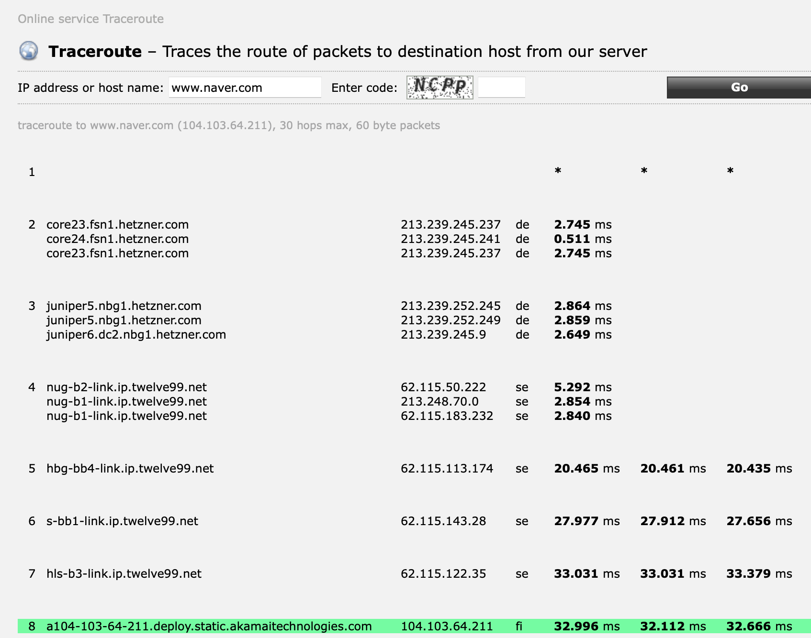
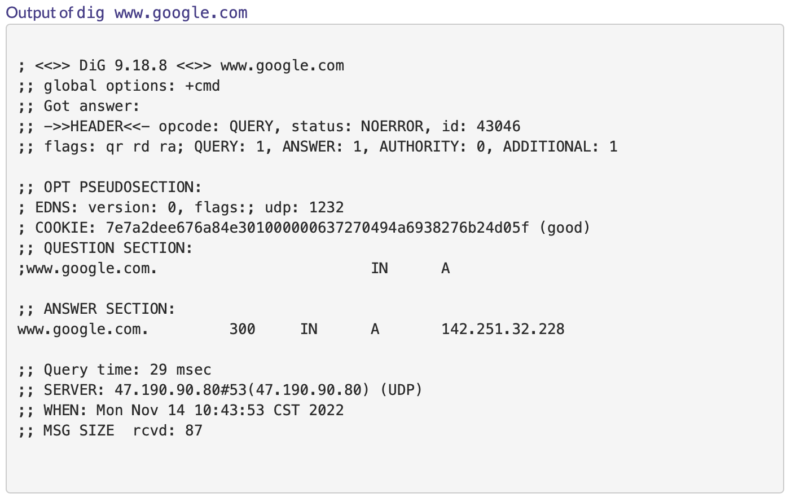

# Quest06.md

## Topics
* 서버와 클라이언트, 그리고 웹 브라우저

> ### Internet Protocol Suite
> 
> Internet Protocol Suite 는 인터넷에서 컴퓨터들이 서로 정보를 주고받는 데 쓰이는 통신규약(프로토콜)의 모음이다. 그 중 TCP 와 IP 가 가장 많이 쓰인다.
> 
> ### TCP/IP
> 
> TCP/IP 는 패킷 통신 방식의 인터넷 프로토콜인 IP 와 전송 조절 프로토콜인 TCP 로 이루어져 있다. IP 는 패킷 전달 여부를 보증하지 않고, 패킷을 보낸 순서와 받는 순서가 다를 수 있다. TCP 는 IP 위에서 동작하는 프로토콜로 데이터의 전달을 보증하고 보낸 순서대로 받게 해준다. HTTP, FTP, SMTP 등 TCP 기반으로 한 많은 수의 애플리케이션 프로토콜들이 IP 위에서 동작하기 때문에, TCP/IP 로 묶어서 부른다.
> 
> ### IP 스택의 계층 구조 4단계
> 
> |계층|설명|
> |---|---|
> |응용 계층|응용 계층(application layer)은 컴퓨터 네트워크 프로그래밍에서 인터넷 프로토콜(IP) 컴퓨터 네트워크를 통하는 프로세스 간 통신 접속을 위해 설계되어 통신 프로토콜과 방식을 위해 보유된 추상 계층이다. 응용 계층 프로토콜은 기반이 되는 전송 계층 프로토콜을 사용하여 호스트 간 연결을 확립한다. BGP, DHCP, DNS, FTP, HTTP, HTTPS, IMAP 등|
> |전송 계층|컴퓨터 처리와 전자 통신에서 전송 계층(Transport layer)은 계층 구조의 네트워크 구성요소와 프로토콜 내에서 송신자와 수신자를 연결하는 통신 서비스를 제공한다. TCP, UDP, QUIC 등|
> |인터넷 계층|인터넷 계층(Internet layer)은 Internet Protocol Suite 에서 인터네트워킹 메소드, 프로토콜, 사양을 모아둔 것으로, 네트워크 경계를 거쳐 호스트로부터 기원한 네트워크 패킷을 필요하면 IP 주소로 지정된 목적지 호스트로 전송하기 위해 사용된다. IP, ARP, ICMP 등|
> |링크 계층|링크 계층(link layer)은 호스트가 물리적으로 연결되는 링크 상에서만 운용되는 메소드, 통신 프로토콜이 모여있다. NDP, OSPF, L2TP, MAC 등|
> 
> ### OSI 모형
> 
> OSI 모형(Open Systems Interconnection Reference Model) 은 국제표준화기구(ISO) 에서 개발한 모델로, OSI 7계층이라고 부른다.
> 
> |계층|설명|
> |---|---|
> |응용 계층|응용 계층(Application layer)은 응용 프로세스와 직접 관계하여 일반적인 응용 서비스를 수행한다.|
> |표현 계층|표현 계층(Presentation layer)은 코드 간의 번역을 담당하여 사용자 시스템에서 데이터의 형식상 차이를 다루는 부담을 응용 계층으로부터 덜어 준다.|
> |세션 계층|세션 계층(Session layer)은 양 끝단의 응용 프로세스가 통신을 관리하기 위한 방법을 제공한다.|
> |전송 계층|전송 계층(Transport layer)은 양 끝단(End to end)의 사용자들이 신뢰성있는 데이터를 주고 받을 수 있도록 해 주어, 상위 계층들이 데이터 전달의 유효성이나 효율성을 생각하지 않도록 해준다.|
> |네트워크 계층|네트워크 계층(Network layer)은 여러개의 노드를 거칠때마다 경로를 찾아주는 역할을 하는 계층으로 다양한 길이의 데이터를 네트워크들을 통해 전달하고, 그 과정에서 전송 계층이 요구하는 서비스 품질(QoS)을 제공하기 위한 기능적, 절차적 수단을 제공한다.|
> |데이터 링크 계층|데이터 링크 계층(Data link layer)은 포인트 투 포인트(Point to Point) 간 신뢰성있는 전송을 보장하기 위한 계층으로 CRC 기반의 오류 제어와 흐름 제어가 필요하다. 네트워크 위의 개체들 간 데이터를 전달하고, 물리 계층에서 발생할 수 있는 오류를 찾아 내고, 수정하는 데 필요한 기능적, 절차적 수단을 제공한다.|
> |물리 계층|물리 계층(Physical layer)은 네트워크의 기본 네트워크 하드웨어 전송 기술을 이룬다. 네트워크의 높은 수준의 기능의 논리 데이터 구조를 기초로 하는 필수 계층이다.|
>
> ### IP 스택과 OSI 모델과의 비교
> 
> 두 모델은 서로 관련은 있으나 완전히 들어맞지는 않는다.
> 
> OSI 모델은 SSL 이나 TLS 를 설명할 때 보통 더 잘 들어맞는다. SSL 이나 TLS 는 TCP 의 상위에, 그리고 HTTP, SFTP 등의 애플리케이션보다는 하위에 있는 세션 계층 프로토콜로 쓰인다.

* 인터넷을 구성하는 여러 가지 프로토콜
  * IP

> ### 인터넷 프로토콜(IP)
> 
> 인터넷 프로토콜은 송신 호스트와 수신 호스트가 패킷 교환 네트워크(패킷 스위칭 네트워크, Packet Switching Network) 에서 정보를 주고받는 데 사용하는 정보 위주의 규약(프로토콜)이며, OSI 네트워크 계층에서 호스트의 주소지정과 패킷 분할 및 조립 기능을 담당한다.
> 
> IP 의 정보는 패킷 혹은 데이터그램이라고 하는 덩어리로 나뉘어 전송되며, IP 에서는 이전에 통신한 적 없는 호스트에 패킷을 보낼 때 경로 설정이 필요없다. IP 는 비신뢰성(unreliability)와 비연결성(connectionlessness)이 특징이다. 비신뢰성은 흐름에 관여하지 않기 때문에 정보가 제대로 갔는지 보장하지 않는다는 뜻이다. 전송 과정에서 패킷이 손상될 수도 있고, 패킷의 순서가 바뀔 수도 있고, 같은 패킷이 두번 전송될 수도 있으며, 전송이 되지 않을 수도 있다. 패킷 전송과 정확한 순서를 보장하려면 TCP 와 같은 상위 프로토콜을 이용해야 한다.

  * TCP

> ### 전송 제어 프로토콜(TCP)
> 
> 전송 제어 프로토콜(Transmission Control Protocol) 은 Internet Protocol Suite 의 핵심 프로토콜 중 하나로, 근거리 통신망이나 인트라넷, 인터넷에 연결된 컴퓨터에서 실행되는 프로그램 간의 일련의 옥텟을 안정적으로, 순서대로, 에러없이 교환할 수 있게 해준다.
> 
> TCP 는 웹 브라우저들이 서버에 연결할 떄 사용되며, 이메일 전송이나 파일 전송에도 사용된다. TCP 의 안정성을 필요로 하지 않는 애플리케이션의 경우 일반적으로 비접속형 사용자 데이터그램 프로토콜(User Datagram Protocol) 을 사용하는데, 이는 전달 확인 및 순차 보장 기능이 없는 대신 오버헤드가 작고 지연시간이 짧다는 장점이 있다.
> 
> ### TCP 세그먼트 구조
> 
> TCP 는 데이터 스트림으로부터 데이터를 받아 이것을 청크 단위로 분할한 뒤 TCP 헤더를 덧붙여 TCP 세그먼트를 생성한다. TCP 세그먼트는 세그먼트 헤더와 데이터의 두 섹션으로 구성되게 된다. 헤더는 10개의 필수 필드 및 옵션 확장 필드들을 포함한다.
> 
> ### 프로토콜의 작동
> 
> TCP 프로토콜의 작동은 크게 세 가지 흐름으로 구분한다.
> 
> 1. 연결 생성 (Connection establishment)
> 2. 자료 전송 (Data transfer)
> 3. 연결 종료 (Connection termination)
> 
> 연결 생성을 위해서는 3방향 핸드셰이크를 사용하며, 종료하기 위해서는 4방향 핸드셰이크를 사용한다.

  * HTTP

> ### HyperText Transfer Protocol(HTTP)
> 
> HTTP 는 W3 상에서 정보를 주고받을 수 있는 프로토콜이다. 주로 HTML 문서를 주고받는 데 쓰인다. 주로 TCP 를 사용하고 HTTP/3 부터는 UDP 를 사용하며, 80번 포트를 사용한다.
> 
> HTTP 는 클라이언트와 서버 사이에서 이루어지는 요청/응답(request/response) 프로토콜이다.
>
> ### 메시지 포맷
> 
> #### 요청 메시지
> 
> 클라이언트가 서버에 보내는 요청 메세지는 요청 내용/헤더/빈 줄/기타 메시지로 구성되어 있다.
> 
> #### 응답 메시지
> 
> 응답 메시지는 상태표시 행(상태 코드와 reason message)/응답 헤더 필드/빈 줄/기타 메시지로 구성되어 있다.

* DNS

> ### 도메인 네임 시스템(Domain Name System, DNS)
>
> 웹사이트에 접속할 때 외우기 어려운 IP 주소 대신 도메인 이름을 사용하게 되는데, 입력한 도메인을 실제 네트워크 상에서 사용하는 IP 주소로 바꾸고 해당 IP 주소로 접속하는 과정을 거치게 된다. 이러한 전체 시스템을 DNS 라고 부르며, DNS 는 상위 기관과 하위 기관이 존재하는 분산 데이터베이스 구조를 가진다.
> 
> ### DNS 구성 요소
> 
> 1. **도메인 네임 스페이스(Domain Name Space)**
>
> 도메인 이름과 IP 주소에 대한 정보를 저장하는 데이터베이스가 필요하며, 도메인 네임 스페이스란 이 도메인 이름 저장을 분산시키는 규칙이다.
>
> 도메인 네임 스페이스는 최상위에 루트 DNS 서버가 존재하고, 그 하위로 연결된 노드들이 연속해서 이어진 계층 구조로 되어있다.
> 
> 2. **네임 서버(Name Server)**
> 
> 네임 서버는 도메인이 입력되었을 때, 해당 도메인에 해당하는 IP 주소를 찾는다.
>
> 전 세계에는 13개의 루트 DNS 서버가 구축되어 있으며, DNS 서버를 복사하여 같은 기능을 담당하는 미러서버도 존재한다.
> 
> |서버|설명|
> |---|---|
> |Root DNS 서버|ICANN 이 직접 관리하며 TLD DNS 서버 IP 주소를 저장하고 안내하는 역할을 한다.|
> |Top-Level Domain(TLD) DNS 서버|도메인 등록 기관이 관리하는 서버이며, Authoritative DNS 서버의 주소를 저장하고 안내하는 역할을 한다. 도메인 판매 업체(가비아 등)의 DNS 설정이 변경되면 도메인 등록 기관으로 전달되기 때문에 어떤 도메인이 어떤 판매업체에서 구매했는지 알 수 있다.|
> |Secondary-Level Domain(SLD) DNS 서버|Authoritative DNS 서버라고도 불리며, 실제 개인 도메인과 IP 주소의 관계가 저장되는 서버이다.|
> |권한 없는 DNS 서버(리졸버 서버)|질의를 통해 IP 주소를 알아내거나 캐시한다.|
> 
> 3. **리졸버(Resolver)**
> 
> 리졸버는 DNS 클라이언트 요청을 네임 서버로 전달하고 찾은 정보를 클라이언트에게 제공하는 기능을 수행한다. 어떤 네임 서버에서 찾아야 하는지, 이미 캐시가 되어있는지 등을 파악하고, 찾지 못했으면 못찾았다고 전달하는 역할도 수행한다.
> 
> 위와 같이 나누어져 있는 이유는, 네임 서버가 한 대만 있지 않기 때문이다. 한 개의 서버로 모든 클라이언트의 요청을 감당할 수 없기 때문에 여러 서버에 정보를 나누어 저장해야 하는데, 모든 서버에 모든 데이터를 저장할 수는 없기 때문에, 도메인을 계층적으로 구분하여 분산하는 구조를 갖게 되었다.
> 
> ### DNS 동작 방식
> 
> 1. 웹 브라우저가 리졸버 서버에 도메인에 해당하는 IP 주소를 요청한다. (xxx.kr)
> 2. 리졸버 서버는 최상위 기관에서 관리하는 네임 서버에 먼저 요청한다.
> 3. 최상위 기관 네임 서버는 .kr 에 대해 한국 국가 도메인이므로 .kr 네임 서버로 가라고 응답한다.
> 4. 리졸버 서버는 .kr 네임 서버에 다시 요청하게 되고,
> 5. .kr 네임 서버는 해당하는 도메인(xxx.kr) 이 어떤 네임 서버에 있는지 응답하게 된다.
> 6. 해당하는 하위 네임 서버에서 숫자로 이루어진 IP 주소를 얻고,
> 7. 웹 브라우저에게 주어진 IP 주소로 이동할 수 있도록 해준다.

## Checklist
* 인터넷은 어떻게 동작하나요? Internet Protocol Suite의 레이어 모델에 입각하여 설명해 보세요.

> 지역 PC가 인터넷에 접근할 때 인터넷 영역에서의 수많은 라우팅을 관리하는 Hob(Default Gateway)가 필요하며, 최종적으로 인터넷 사이트에 해당하는 라우터에 접근한다.
> 
> 보통 상대의 목적지 IP 주소는 특정 값으로 정해지지만, 인터넷의 경우엔 0.0.0.0/0 으로 특정지어지지 않는다.
> 
> 라우팅 경로 정보가 정해져있는 정적라우팅과는 달리, 네트워크 상황에 따라 정보를 빠르게 확보할 수 있는 경로를 중심으로 패킷을 전송하는 라우팅이다.
> 
> 데이터 정보에 포함된 목적지 주소가 인터넷처럼 광범위하거나, 정적 라우팅을 통한 탐색이 불가능할 경우 동적 라우팅(보통 지역 통신사 등)을 통해 데이터 전달을 진행한다.

  * 근거리에서 서로 떨어진 두 전자기기가 유선/무선으로 서로 통신하는 프로토콜은 어떻게 동작할까요?

> 근거리에 놓여진 두 기기의 네트워크 대역은 보통 정적 라우팅을 통해 연결하며, 라우팅 테이블에 저장된 두 기기의 IP 와 PORT 정보를 통해 데이터 전달이 이루어진다.
> 
> 와이파이를 통해 연결한다면 무선 공유기를 통한 라우팅을 진행하고, 블루투스를 통해 연결한다면 BLE stack 프로토콜을 기반으로 통신을 진행한다.

  * 근거리에 있는 여러 대의 전자기기가 서로 통신하는 프로토콜은 어떻게 동작할까요?
  * 아주 멀리 떨어져 있는 두 전자기기가 유선/무선으로 서로 통신하는 프로토콜은 어떻게 동작할까요?

> 사용하는 프로토콜은 두 기기가 네트워크를 어떤 형태를 통해 연결하였는지, 어떤 통신규약을 채용하고 있는지에 영향을 받는다.
> 
> 보통 멀리 떨어져 있는 기기의 경우엔 근거리 대역의 네트워크가 없어 라우팅 테이블 작성이 어려우므로, 인터넷과 같이 Hob(지역 통신사)를 통한 데이터 전달이 이루어진다.

  * 두 전자기기가 신뢰성을 가지고 통신할 수 있도록 하기 위한 프로토콜은 어떻게 동작할까요?

> 웹과 사용자간의 대표적인 통신 규약인 HTTP는, SSL 인증을 적용한 HTTPS 프로토콜을 사용하여 보안을 적용한다. 이는 HTTP 프로토콜을 통한 데이터 통신 과정에 SSL/TLS 암호화 방식(양방향 암호화)를 적용하는 것이다.

  * HTTP는 어떻게 동작할까요?

> 웹(서버를 통해 운용되는 HTML 문서)과 사용자 간 정보를 주고 받기 위해 사용하는 통신 규약이다. 개발자가 구성한 알고리즘 및 문서 구성(HTML)에 따라 데이터 및 헤더에 데이터를 저장하고, request/response 를 기반으로 웹사이트 동작이 이루어진다.

* 우리가 브라우저의 주소 창에 www.knowre.com 을 쳤을 때, 어떤 과정을 통해 서버의 IP 주소를 알게 될까요?

## Quest
* tracert(Windows가 아닌 경우 traceroute) 명령을 통해 www.google.com 까지 가는 경로를 찾아 보세요.
  * 어떤 IP주소들이 있나요?
  * 그 IP주소들은 어디에 위치해 있나요?

* Wireshark를 통해 www.google.com 으로 요청을 날렸을 떄 어떤 TCP 패킷이 오가는지 확인해 보세요
  * TCP 패킷을 주고받는 과정은 어떻게 되나요?
  * 각각의 패킷에 어떤 정보들이 담겨 있나요?
* telnet 명령을 통해 http://www.google.com/ URL에 HTTP 요청을 날려 보세요.
  * 어떤 헤더들이 있나요?
  * 그 헤더들은 어떤 역할을 하나요?

## Advanced
* HTTP의 최신 버전인 HTTP/3는 어떤 식으로 구성되어 있을까요?
* TCP/IP 외에 전세계적인 네트워크를 구성하기 위한 다른 방식도 제안된 바 있을까요?
