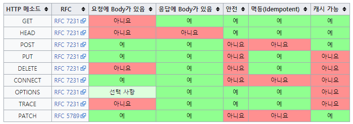

# Quest08

## Topics
* HTTP Method

> ### HTTP 메소드
> 
> HTTP 메소드는 **클라이언트가 웹 서버에게 사용자 요청의 목적이나 종류를 알리는 수단**이다. 최초에는 GET 메소드 하나밖에 없었지만 이후 다양한 메소드들이 생겨났다.
> 
> ### HTTP 메소드의 종류와 특징
> 
> HTTP 메소드는 총 9가지가 있고, 이 중 5가지가 주로 쓰인다.
> 
> - GET: 리소스 조회
> - POST: 요청 데이터 처리, 주로 데이터 등록에 사용
> - PUT: 리소스를 대체, 해당 리소스가 없으면 생성
> - PATCH: 리소스를 일부만 변경
> - DELETE: 리소스 삭제
> - HEAD: GET 과 동일하지만 메세지 부분을 제외하고, 상태 줄과 헤더만 반환
> - OPTIONS: 대상 리소스에 대한 통신 가능 옵션을 설명
> - CONNECT: 대상 자원으로 식별되는 서버에 대한 터널을 설정
> - TRACE: 대상 리소스에 대한 경로를 따라 메시지 루프백 테스트를 수행
> 
> ### HTTP 메소드의 속성
> 
> 1. **안전(Safe Methods)**: 계속해서 메소드를 호출해도 리소스를 변경하지 않는다. 주요 메소드 중에는 GET 메소드가 안전하다.
> 2. **멱등(Idempotent Methods)**: 메소드를 계속 호출해도 결과가 같다. GET, PUT, DELETE 는 멱등하다고 볼 수 있지만 POST, PATCH 는 멱등하다고 볼 수 없다.
> 3. **캐시가능(Cacheable Methods)**: 캐싱을 해서 데이터를 효율적으로 가져올 수 있다. GET, HEAD, POST, PATCH 가 캐시가 가능하지만 실제로는 GET, HEAD 만 주로 캐싱이 쓰인다.
>
> 
> 
> ### HTTP 상태코드
> 
> HTTP 상태코드는 클라이언트가 보낸 요청의 처리 상태를 응답에서 알려주는 기능이다.
> 
> - 1xx (Informational): 요청이 수신되어 처리중
> - 2xx (Successful): 요청 정상 처리
> - 3xx (Redirection): 요청을 완료하면 추가 행동이 필요
> - 4xx (Client Error): 클라이언트 오류, 잘못된 문법 등으로 서버가 요청을 수행할 수 없음.
> - 5xx (Server Error): 서버 오류, 서버가 정상 요청을 처리하지 못함
> 
> ### HTTP 상태코드 종류와 의미
> 
> 100번대는 요청이 수신되어 처리중이라는 뜻인데 거의 사용되지 않는다.
> 
> **200번대**
> 
> - 200 OK: 요청 성공
> - 201 Created: 요청 성공해서 새로운 리소스가 생성됨
> - 202 Accepted: 요청이 접수되었으나 처리가 완료되지 않았음
> - 204 No Content: 서버가 요청을 성공적으로 수행했지만, 응답 페이로드 본문에 보낼 데이터가 없음
> 
> **300번대**
> 
> - 301 Moved Permanently : 리다이렉트시 요청 메서드가 GET으로 변하고, 본문이 제거될 수 있음
> - 302 Found : 리다이렉트시 요청 메서드가 GET으로 변하고, 본문이 제거될 수 있음
> - 303 See Other : 리다이렉트시 요청 메서드가 GET으로 변경
> - 304 Not Modified : 캐시를 목적으로 사용
> - 307 Temporary Redirect : 리다이렉트시 요청 메서드와 본문 유지(요청 메서드를 변경하면 안된다.)
> - 308 Permanent Redirect : 리다이렉트시 요청 메서드와 본문 유지(처음 POST를 보내면 리다이렉트도 POST 유지)
> 
> **400번대**
> 
> - 400 Bad Request : 클라이언트가 잘못된 요청을 해서 서버가 요청을 처리할 수 없음
> - 401 Unauthorized : 클라이언트가 해당 리소스에 대한 인증이 필요함
> - 403 Forbidden : 서버가 요청을 이해했지만 승인을 거부함
> - 404 Not Found : 요청 리소스를 찾을 수 없음
>
> **500번대**
> 
> - 500 Internal Server Error : 서버 문제로 오류 발생, 애매하면 500 오류
> - 503 Service Unavailable : 서비스 이용 불가

* node.js `http` module
  * `req`와 `res` 객체

> ### Node.js HTTP Module
> 
> 

## Resources
* [MDN - Content-Type Header](https://developer.mozilla.org/en-US/docs/Web/HTTP/Headers/Content-Type)
* [MDN - HTTP Methods](https://developer.mozilla.org/en-US/docs/Web/HTTP/Methods)
* [MDN - MIME Type](https://developer.mozilla.org/en-US/docs/Glossary/MIME_type)
* [Postman](https://chrome.google.com/webstore/detail/postman/fhbjgbiflinjbdggehcddcbncdddomop)
* [HTTP Node.js Manual & Documentation](https://nodejs.org/api/http.html)

## Checklist
* HTTP의 GET과 POST 메소드는 어떻게 다른가요?
  * 다른 HTTP 메소드에는 무엇이 있나요?
* HTTP 서버에 GET과 POST를 통해 데이터를 보내려면 어떻게 해야 하나요?
  * HTTP 요청의 `Content-Type` 헤더는 무엇인가요?
  * Postman에서 POST 요청을 보내는 여러 가지 방법(`form-data`, `x-www-form-urlencoded`, `raw`, `binary`) 각각은 어떤 용도를 가지고 있나요?
* node.js의 `http` 모듈을 통해 HTTP 요청을 처리할 때,
  * `req`와 `res` 객체에는 어떤 정보가 담겨있을까요?
  * GET과 POST에 대한 처리 형태가 달라지는 이유는 무엇인가요?
* 만약 API 엔드포인트(URL)가 아주 많다고 한다면, HTTP POST 요청의 `Content-Type` 헤더에 따라 다른 방식으로 동작하는 서버를 어떻게 정리하면 좋을까요?
  * 그 밖에 서버가 요청들에 따라 공통적으로 처리하는 일에는 무엇이 있을까요? 이를 어떻게 정리하면 좋을까요?

## Quest
* 다음의 동작을 하는 서버를 만들어 보세요.
  * 브라우저의 주소창에 `http://localhost:8080`을 치면 `Hello World!`를 응답하여 브라우저에 출력합니다.
  * 서버의 `/foo` URL에 `bar` 변수로 임의의 문자열을 GET 메소드로 보내면, `Hello, [문자열]`을 출력합니다.
  * 서버의 `/foo` URL에 `bar` 키에 임의의 문자열 값을 갖는 JSON 객체를 POST 메소드로 보내면, `Hello, [문자열]`을 출력합니다.
  * 서버의 `/pic/upload` URL에 그림 파일을 POST 하면 서버에 보안상 적절한 방법으로 파일이 업로드 됩니다.
  * 서버의 `/pic/show` URL을 GET 하면 브라우저에 위에 업로드한 그림이 뜹니다.
  * 서버의 `/pic/download` URL을 GET 하면 브라우저에 위에 업로드한 그림이 `pic.jpg`라는 이름으로 다운로드 됩니다.
* expressJS와 같은 외부 프레임워크를 사용하지 않고, node.js의 기본 모듈만을 사용해서 만들어 보세요.
* 처리하는 요청의 종류에 따라 공통적으로 나타나는 코드를 정리해 보세요.

## Advanced
* 서버가 파일 업로드를 지원할 때 보안상 주의할 점에는 무엇이 있을까요?
