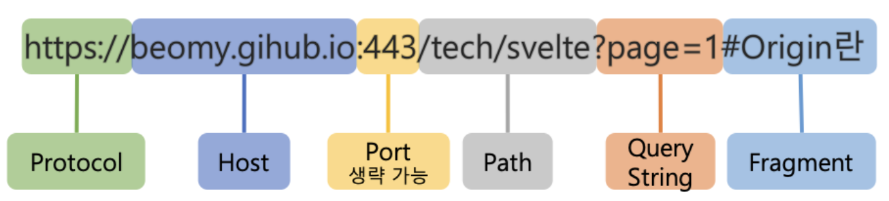

# Quest09

## Topics
* expressJS, fastify

> ### Express.js
> 
> Express.js 는 Node.js 의 핵심 모듈인 http 와 Connect 컴포넌트를 기반으로 하는 웹 프레임워크다. 그러한 컴포넌트를 미들웨어(middleware)라고 하며, 설정보다는 관례(convention over configuration)와 같은 프레임워크 철학을 지탱하는 주춧돌에 해당한다. 개발자들은 특정 프로젝트에 필요한 라이브러리를 어떤 것이든 자유롭게 선택할 수 있다.
> 
> Express.js 는 다양한 문제를 해결함과 동시에 웹 앱의 MVC 형태의 구조를 제공한다. 이 같은 앱은 백엔드만 갖춘 REST API 에서부터 온갖 기능을 제공하는 풀스택 실시간 웹 앱에 이르기까지 다양한다.
> 
> ### Express.js 의 작동 방식
> 
> Express.js 에는 메인 파일이라고 하는 진입점이 있다. 메인 파일에서는 다음과 같은 단계를 밟는다.
> 
> 1. 컨트롤러, 유틸리티, 도우미, 모델과 같은 자체적인 모듈을 비롯한 서드파티 의존 모듈을 인클루드한다.
> 2. 템플릿 엔진과 해당 템플릿 엔진의 파일 확장자와 같은 Express.js 앱 설정을 구성한다.
> 3. 오류 핸들러, 정적 파일 폴더, 쿠키 및 키타 파서와 같은 미들웨어를 정의한다.
> 4. 라우팅을 정의한다.
> 5. MongoDB, Rdis 또는 MySQL 과 같은 데이터베이스와 연결한다.
> 6. 앱을 구동한다.
> 
> Express.js 앱이 실행되면 Express.js 가 요청을 대기한다. 앱으로 들어오는 각 요청은 정의된 미들웨어와 라우팅에 따라 맨 위에서 시작해 맨 아래까지 처리된다. 이러한 측면은 실행 흐름을 제어하는데 중요하다.
> 
> 1. 쿠키 정보를 파싱하고, 파싱이 완료되면 다음 단계로 이동한다.
> 2. URL 로부터 매개변수를 파싱하고, 파싱이 완료되면 다음 단계로 이동한다.
> 3. 사용자가 인증되면(쿠키/세션) 매개변수의 값을 토대로 데이터베이스에서 정보를 가져와 일치하는 것이 있으면 다음 단계로 이동한다.
> 4. 데이터를 표시하고 응답을 마친다.
> 
> ### Fastify
> 
> 효율적인 서버는 낮은 비용으로 높은 응답성을 보여 사용자 경험을 향상시키되, 보안성을 유지하고 개발자의 개발에 불편함을 주지 않는 것이 중요하다. Fastify 는 최소한의 오버헤드와 강력한 플러그인 아키텍쳐로 최고의 개발 경험을 제공하는데에 초점을 맞춘 웹 프레임워크이다. 현재까지 가장 빠른 웹 프레임워크 중 하나이다.
> 
> ### Fastify 의 Core Features
> 
> 1. High performant: 초당 최대 3만건의 요청을 처리할 수 있는 가장 빠른 웹 프레임워크 중 하나이다.
> 2. Extendible(확장성): hooks, plugins, decorators 를 활용해 확장이 가능하다.
> 3. Schema based: 필수는 아니지만 fasify 는 JSON schema 를 사용하여 경로를 검사하고 출력을 직렬화할 수 있다.
> 4. Logging: 로그는 매우 중요하지만 비용이 큰데, 이 비용을 없애기 위해 Pino logger 를 선택했다.
> 5. Developer friendly: 개발자들에게 보안의 희생 없이 다양한 표현이 가능하고 일상적으로 사용하는데 도움되도록 제작되었다.

* AJAX, `XMLHttpRequest`, `fetch()`

> ### AJAX
> 
> AJAX 는 Asynchronous JavaScript and XML 의 약자로, JavaScript 와 XML 을 이용한 비동기적 정보 교환 기법이다. XML 이라고 이름에 명시되어있기는 하지만, JSON 이나 일반 텍스트 파일과 같은 다른 데이터 오브젝트들도 사용 가능해서 최근에는 JSON 을 많이 다룬다.
> 
> ### AJAX 역사
> 
> AJAX 가 등장하기 이전에는 웹 브라우저가 어떤 정보를 요청하면 서버는 해당 정보를 포함한 페이지 전체를 전달해 주었다. 웹 브라우저는 서버로 받은 마크업 데이터를 브라우저 창에 렌더링하는 일을 했고, 이는 웹 브라우저에게 매번 똑같은 레이아웃의 페이지를 처음부터 다시 렌더링해야하고, 서버는 매번 같은 페이지를 렌더링해야해서 서로 부담이 되었다.
> 
> AJAX 는 웹 페이지의 디자인 요소와 정보 요소를 분리한다. 처음 웹 사이트에 접속하면 해당 페이지의 스타일과 레이아웃을 정의하는 정적 HTML 파일과 CSS 파일, 그리고 데이터를 어떻게 요청하는지를 설명한 JavaScript 파일을 전달받고, 브라우저는 이 내용을 바탕으로 기본 골격을 구축한다. 이후 브라우저는 JavaScript 를 이용해 서버에 데이터만을 별도로 요청하는데, 서버에서 응답하는 데이터 객체가 XML 혹은 JSON 이다. 브라우저는 이 데이터를 만들어둔 틀 안에 적절한 방법으로 끼워넣는다.
> 
> 과거에는 MS 가 1999년 IE5 에 Microsoft.XMLHTTP 라는 이름으로 유일하게 제공했지만, 이 컴포넌트는 윈도우에 탑재된 ActiveX 를 이용하는 비표준 기술이며, 무거운 http 로 무거운 xml 을 받아온다는 사실에 아무도 관심을 갖지 않았다.
> 
> 시간이 흘러 넷스케이프를 이어받은 모질라가 XMLHttpRequest 메서드를 추가하여 2002년부터 본격적으로 사용되었고, 이후 사파리, 오페라에도 연달아 도입되었다.
> 
> 구글이 2004년 Gmail, 2005년에 구글 지도를 아무런 플러그인 없이 AJAX 로 구현해 발표하면서 화제가 되었고, 이후 급속도로 확산되었다. 최근에는 XMLHttpRequest 를 보완한 비동기(promise) 방식의 Fetch API 를 주로 사용한다.
> 
> ### AJAX 의 단점
> 
> AJAX 는 동적 페이지 렌더링을 하기 때문에 자바스크립트를 해석하지 못하는 검색 엔진에서는 내용이 검색되지 않는다.
> 
> 레이아웃이 너무 복잡한 사이트트 웹 브라우저가 렌더링 하는데에 힘겨워할 수 있다. 신속하게 첫 화면을 보여주어야 하는 경우에도 AJAX 는 최소 두번의 데이터 요청(일반적으로 4회 이상)을 해야하는 문제가 있어 속도가 저하되게 된다. 이런 경우에는 서버가 모든 페이지를 그려서 전달하게 된다.
> 
> 또한 JavaScript 를 반드시 써야하기 때문에, 스크립팅이 제한되는 특수목적 기기(디지털 액자와 같은 초저성능 기기) 등에서 자바스크립트 엔진을 돌릴 여견이 안된다면, AJAX 기반 사이트는 화면에 일부만 보여지게 된다.
> 
> ### AJAX 대체/보완 기술
>
> AJAX 는 비동기 데이터 전송 기술이지만 '양방향' 기술이 아니며 또한 '요청-응답' 사이클이 지나고 나면 통신 소켓을 닫아버린다는 문제가 있다. 이에 완전한 실시간 통신을 지원하기 위해 웹소켓이라는 새로운 기술이 구현되었다. 웹 소켓은 요청-응답 사이클이 지나도 통신 소켓을 닫지 않고 계속해서 요청을 송수신할 수 있도록 기존의 HTTP 프로토콜에 약간의 변경을 가한다.
> 
> 웹 소켓은 TCP 에 기반하고 있어 대규모 실시간 데이터 전송에 적합하지 않아 UDP 에 기반한 WebRTC 라는 기술도 구현되었다. WebRTC 는 서버의 중개를 필요로하지 않는 브라우저간 P2P 통신 채널을 형성하는 기능도 갖고있다.
>
> AJAX 기술 위에서 구현된 실시간 통신 기술로 Long polling 기술도 있다. 이는 서버에 요청을 보내면 서버는 즉시 응답을 주는 게 아니라 새로운 정보가 갱신될 때까지 소켓을 열어둔 채 응답을 미룬다. 새로운 정보가 들어오면 그때 열려 있는 소켓을 통해 응답을 돌려주며 브라우저는 응답을 받는 즉시 새로운 요청을 서버에 날린다. 이런 식으로 '응답하면 통신 채널이 닫히는' 문제를 우회하여 해결한다. Socket.io 라이브러리는 웹 소켓이 지원되지 않는 브라우저가 감지되면 이 Long polling 방식으로 통신 방식을 바꾼다.

* REST, CRUD

> ### REST(Representational State Transfer)
>
> REST 는 자원을 이름으로 구분하여 해당 자원의 상태를 주고받는 모든 것을 의미한다. 즉, 자원(resource) 의 표현(representation) 에 의한 상태 전달을 의미한다. 여기서 자원이란 그림, 문서, 데이터 등 해당 소프트웨어가 관리하는 모든 것들을 의미하며, 자원의 표현은 그 자원을 표현하기 위한 이름이다. 데이터가 요청되어지는 시점에서 자원의 정보를 전달하며 XML, JSON 을 통해 데이터를 주고받는 것이 일반적이다.
>
> REST 는 월드 와이드 웹과 같은 분산 하이퍼미디어 시스템을 위한 소프트웨어 개발 아키텍처의 한 형식으로, 기본적으로 웹의 기존 기술과 HTTP 프로토콜을 그대로 활용하기 때문에 웹의 장점을 최대한 활용할 수 있는 아키텍처 스타일이다.
>
> ### REST 의 구체적인 개념
>
> HTTP URI(Uniform Resource Identifier)를 통해 자원(Resource)를 명시하고, HTTP Method 를 통해 해당 자원에 대한 CRUD Operation 을 적용하는 것을 의미한다.
>
> 즉, REST 는 자원 기반의 구조(ROA, Resource Oriented Architecture) 설계의 중심에 Resource 가 있고, HTTP Method 를 통해 Resource 를 처리하도록 설계된 아키텍쳐를 의미한다.
> 
> ### REST 의 장점
>
> - HTTP 프로토콜의 인프라를 그대로 사용하므로 REST API 사용을 위한 별도의 인프라르 구축할 필요가 없다.
> - HTTP 프로토콜의 표준을 최대한 활용하여 여러 추가적인 장점을 함께 가져갈 수 있게 해준다.
> - HTTP 표준 프로토콜에 따르는 모든 플랫폼에서 사용이 가능하다.
> - Hypermedia API 의 기본을 충실히 지키면서 범용성을 보장한다.
> - REST API 메세지가 의도하는 바를 명확하게 나타내므로 의도하는 바를 쉽게 파악할 수 있다.
> - 여러가지 서비스 디자인에서 생길 수 있는 문제를 최소화한다.
> - 서버와 클라이언트의 역할을 명확하게 분리한다.
>
> ### REST 의 단점
>
> - 표준이 존재하지 않는다.
> - 사용할 수 있는 메소드가 제한적이다.
> - 구형 브라우저가 지원하지 않는 부분이 존재한다. (PUT, DELETE Method, pushState 등)
>
> ### REST 구성 요소
>
> 1. **자원(Resource)**: URI
>
> > - 모든 자원에 고유한 ID 가 존재하고, 이 자원은 Server 에 존재한다.
> > - 자원을 구별하는 ID 는 '/groups/:group_id' 와 같은 HTTP URI 다.
> > - Client 는 URI 를 이용해서 자원을 지정하고 해장 자원의 정보에 대한 조작을 Server 에 요청한다.
>
> 2. **행위(Verb)**: HTTP Method
>
> > - HTTP 프로토콜의 Method 를 사용한다.
>
> 3. **표현(Representation of Resource)**
>
> > - Client 가 자원의 정보에 대한 조작을 요청하면 Server 는 이에 적절한 응답(Representation) 을 보낸다.
> > - REST 에서 하나의 자원은 JSON, XML, TEXT, RSS 등 여러 형태의 Representation 으로 나타내어 질 수 있다. (JSON 혹은 XML 로 데이터를 주고받는 것이 일반적)
>
> ### REST 특징
>
> 1. **Server-Client 구조**
>
> > - 자원이 있는 쪽이 Server, 자원을 요청하는 쪽이 Client 가 된다. Server 는 API 를 제공하고 비즈니스 로직 처리 및 저장을 책임진다. Client 는 사용자 인증이나 context 등을 직접 관리하고 책임진다.
>
> 2. **Stateless(무상태)**
>
> > -  HTTP 프로토콜은 Stateless Protocol 이므로 REST 역시 무상태성을 갖는다.
> > - Client 의 context 를 Server 에 저장하지 않는다. 즉, 세션, 쿠키와 같은 context 정보를 신경쓰지 않아도 되므로 구현이 단순해진다.
> > - Server 는 각각의 요청을 완전히 별개의 것으로 인식하고 처리한다. 즉, 이전 요청이 다음 요청의 처리에 연관이 되어서는 안되며, 이로 인해 Server 의 처리 방식에 일관성을 부여하고 부담을 줄이며, 서비스의 자유도가 높아진다.
>
> 3. **Cacheable(캐시 처리 가능)**
>
> > - 웹 표준 HTTP 프로토콜을 그대로 사용하므로 웹에서 사용하는 기존의 인프라르 그대로 활용할 수 있다. 따라서 HTTP 가 가진 가장 강력한 특징 중 하나인 캐싱 기능을 적용할 수 있다. HTTP 프로토콜 표준에서 사용하는 Last-Modified 태그나 E-Tag 를 이용하면 캐싱 구현이 가능하다.
> > - 대량의 요청을 효율적으로 처리하기 위해 캐시가 요구된다.
> > - 캐시 사용을 통해 응답시간이 빨라지고 REST Server 트랜잭션이 발생하지 않기 때문에 전체 응답시간, 성능, 서버의 자원이용률을 향상시킬 수 있다.
>
> 4. **Layered System(계층화)**
>
> > - Client 는 REST API Server 만 호출한다.
> > - REST Server 는 다중 계층으로 구성될 수 있다. API Server 는 순수 비즈니스 로직을 수행하고, 그 앞단에 보안, 로드밸런싱, 암호화, 사용자 인증 등을 추가하여 구조상의 유연성을 줄 수 있다. 또한 로드밸런싱, 공유 캐시 등을 통해 확장성과 보안성을 향상시킬 수 있다.
>
> 5. **Code-On-Demand**
>
> > - Server 로 부터 스크립트를 받아서 Client 에서 실행한다.
>
> 6. **Uniform Interface(인터페이스 일관성)**
>
> > - URI 로 지정한 Resource 에 대한 조작을 통일되고 한정적인 인터페이스로 수행한다.
> > - HTTP 표준 프로토콜에 따르는 모든 플랫폼에서 사용이 가능하다.

* CORS

> ### CORS (Cross-Origin Resource Sharing)
>
> CORS 는 교차 출처 리소스 공유로 번역될 수 있는데, 브라우저에서 다른 출처의 리소스를 공유하는 방법이다.
>
> ### URL 구조와 출처(Origin)
>
> 
>
> 출처가 무엇인지 알기 위해서는 URL 의 구조를 알아야 한다. 프로토콜의 HTTP 는 80번, HTTPS 는 443번 포트를 사용하는데, 80번과 443번 포트는 생략이 가능하다.
>
> 출처란 URL 구조에서 Protocol, Host, Port 를 합친 것을 말한다.
>
> ### 동일 출처 정책(Same-Origin Policy) 이란?
>
> API 를 테스트하는 중에 CORS policy 오류가 발생할 수 있다. 이는 브라우저가 동일 출처 정책(Same-Origin Policy, SOP) 를 지켜서 다른 출처의 리소스 접근을 금지하기 때문이다.
>
> 동일 출처 정책을 지키면 외부 리소스를 가져오지 못해 불편하지만, XSS 나 XSRF 등 보안 취약점을 노린 공격을 방어할 수 있다. 하지만 현실적으로는 외부 리소스 참고가 필요하기 때문에 외부 리소스를 가져올 수 있는 방법이 존재해야 하고, 외부 리소스를 사용하기 위한 SOP 의 예외 조항이 CORS 이다.
>
> ### CORS 동작 원리
>
> CORS 의 동작 방식은 단순 요청 방법과 예비 요청을 먼저 보내는 방법 2가지가 있다.
>
> > ### Simple Request
> > 
> > 단순 요청 방법은 서버에 바로 요청을 보내는 방법이다. 서버에 API를 요청하고, 서버는 `Access-Control-Allow-Origin` 헤더를 포함한 응답을 브라우저에 보내게 된다. 브라우저는 해당 헤더를 확인하여 CORS 동작을 수행할지 판단하게 된다.
> >
> > 서버로 전달하는 요청(request)은 아래의 3가지 조건을 만족해야 동작되게 된다.
> >
> > 1. 요청 메서드는 GET, HEAD, POST 중 하나여야 한다.
> > 2. Accept, Accept-Language, Content-Language, Content-Type, DPR, Downlink, Save-Data, Viewport-Width, Width 를 제외한 헤더를 사용하면 안된다.
> > 3. Content-Type 헤더는 application/x-www-form-urlencoded, multipart/form-data, text/plain 중 하나를 사용해야 한다.
> >
> > 첫번째 조건과 다르게, 2번 조건은 사용자 인증에 사용되는 Authorization 헤더도 포함되지 않으며, 3번 조건은 많은 REST API 들이 Content-Type 으로 application/json 을 사용하기 때문에 지켜지기 어려운 까다로운 조건이다.
>
> > ### Preflight Request
> >
> > Preflight 요청은 서버에 예비 요청을 보내서 안전한지 판단한 후 본 요청을 보내는 방법이다. Preflight 요청은 실제 리소스를 요청하기 전에 `OPTIONS` 라는 메서드를 통해 실제 요청을 전송할 지 판단한다.
> >
> > `OPTIONS` 메서드로 서버에 예비 요청을 보내고, 서버는 이 예비 요청에 대한 응답으로 Access-Control-Allow-Origin 헤더를 포함한 응답을 브라우저에 보낸다. 브라우저는 해당 헤더를 확인해서 CORS 동작을 수행할 지 판단한다.
>
> ### CORS 에러 해결 방법
> 

## Resources
* [Express Framework](http://expressjs.com/)
* [Fastify Framework](https://www.fastify.io/)
* [MDN - Fetch API](https://developer.mozilla.org/en-US/docs/Web/API/Fetch_API)
* [MDN - XMLHttpRequest](https://developer.mozilla.org/en-US/docs/Web/API/XMLHttpRequest)
* [REST API Tutorial](https://restfulapi.net/)
* [CRUD](https://en.wikipedia.org/wiki/Create,_read,_update_and_delete)
* [MDN - CORS](https://developer.mozilla.org/en-US/docs/Web/HTTP/CORS)

## Checklist
* 비동기 프로그래밍이란 무엇인가요?
  * 콜백을 통해 비동기적 작업을 할 때의 불편한 점은 무엇인가요? 콜백지옥이란 무엇인가요?
  * 자바스크립트의 Promise는 어떤 객체이고 어떤 일을 하나요?
  * 자바스크립트의 `async`와 `await` 키워드는 어떤 역할을 하며 그 정체는 무엇일까요?
* 브라우저 내 스크립트에서 외부 리소스를 가져오려면 어떻게 해야 할까요?
  * 브라우저의 `XMLHttpRequest` 객체는 무엇이고 어떻게 동작하나요?
  * `fetch` API는 무엇이고 어떻게 동작하나요?
* REST는 무엇인가요?
  * REST API는 어떤 목적을 달성하기 위해 나왔고 어떤 장점을 가지고 있나요?
  * RESTful한 API 설계의 단점은 무엇인가요?
* CORS란 무엇인가요? 이러한 기능이 왜 필요할까요? CORS는 어떻게 구현될까요?

## Quest
* 이번 퀘스트는 Midterm에 해당하는 과제입니다. 분량이 제법 많으니 한 번 기능별로 세부 일정을 정해 보고, 과제 완수 후에 그 일정이 얼마나 지켜졌는지 스스로 한 번 돌아보세요.
  * 이번 퀘스트부터는 skeleton을 제공하지 않습니다!
* Quest 05에서 만든 메모장 시스템을 서버와 연동하는 어플리케이션으로 만들어 보겠습니다.
  * 클라이언트는 `fetch` API를 통해 서버와 통신합니다.
  * 서버는 8000번 포트에 REST API를 엔드포인트로 제공하여, 클라이언트의 요청에 응답합니다.
  * 클라이언트로부터 온 새 파일 저장, 삭제, 다른 이름으로 저장 등의 요청을 받아 서버의 로컬 파일시스템을 통해 저장되어야 합니다.
    * 서버에 어떤 식으로 저장하는 것이 좋을까요?
  * API 서버 외에, 클라이언트를 띄우기 위한 서버가 3000번 포트로 따로 떠서 API 서버와 서로 통신할 수 있어야 합니다.
  * Express나 Fastify 등의 프레임워크를 사용해도 무방합니다.
* 클라이언트 프로젝트와 서버 프로젝트 모두 `npm i`만으로 디펜던시를 설치하고 바로 실행될 수 있게 제출되어야 합니다.
* 이번 퀘스트부터는 앞의 퀘스트의 결과물에 의존적인 경우가 많습니다. 제출 폴더를 직접 만들어 제출해 보세요!

## Advanced
* `fetch` API는 구현할 수 없지만 `XMLHttpRequest`로는 구현할 수 있는 기능이 있을까요?
* REST 이전에는 HTTP API에 어떤 패러다임들이 있었을까요? REST의 대안으로는 어떤 것들이 제시되고 있을까요?
