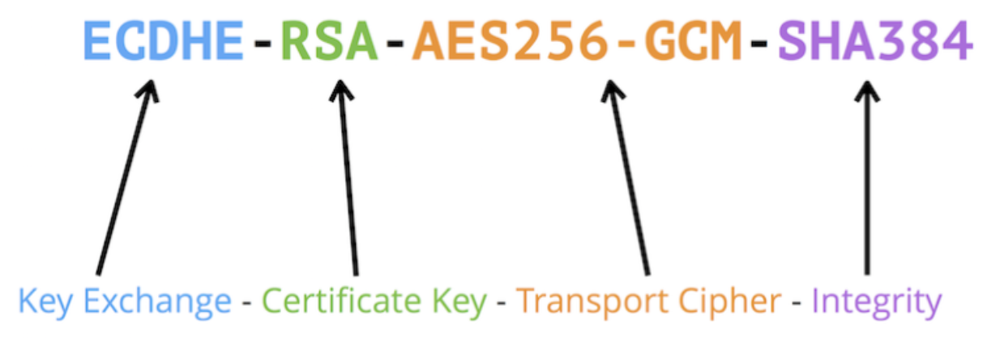

# Quest 12. 보안의 기초

## Topics
* XSS, CSRF, SQL Injection

> ## XSS
>
> Cross Site Scripting 의 약자로 웹 해킹 공격 기법 중 하나로, 게시판이나 웹 메일 등에 자바 스크립트와 같은 스크립트 코드를 삽입 해 개발자가 고려하지 않은 기능이 작동하게 하는 공격 방법이다. 웹 애플리케이션이 사용자로부터 입력받은 값을 제대로 검사하지 않고 사용할 경우 나타나며, 보통 의도치 않은 행동을 수행시키거나 쿠키나 세션 토큰 등의 민감한 정보를 탈취한다. 크게 Reflected XSS, Stored XSS, DOM Based XSS 로 분류할 수 있다.
>
> ### Reflected XSS
>
> URL의 변수 부분처럼 스크립트 코드를 입력하는 동시에 결과가 바로 전해지는 공격기법니다. 공격자가 HTTP 요청에 악성 콘텐츠를 주입하면 그 결과가 사용자에게 "반사되는" 형태이다. 링크를 클릭하도록 피해자를 속이고 유인해 세션을 하이재킹할 수 있다.
>
> ### Stored XSS
>
> Stored XSS는 가장 일반적인 XSS 공격 유형으로 웹 사이트 게시판에 스크립트를 삽입하는 공격 방식이다. 공격자는 게시판에 스크립트를 삽입한 후, 공격 대상자가 해당 게시글을 클릭하도록 유도한다.
>
> 공격자가 미리 XSS 공격에 취약한 사이트를 탐색하고 XSS 공격을 위한 스크립트를 포함한 게시글을 웹 사이트에 업로드한다. 즉 공격자가 웹 애플리케이션을 속여 데이터베이스에 악성코드를 "저장"하도록 하는 수법이다. 서버에 저장된 악성코드는 시스템 자체를 공격할 구 있으며 웹 앱 사용자 상당수 또는 전체에 악성 코드를 전송할 수 있게 된다.
>
> ### XSS 방지법
>
> XSS 공격은 IPS, IDS, 방화벽으로 방지할 수 없고, 단순히 문자를 필터링하는 방법만이 존재한다. 서버측에서 사용자의 입력값에 대한 필터링을 진행해야 한다. PHP의 eregi 함수를 이용하면 XSS 공격에 주로 사용되는 문자들을 필터링할 수 있다. 혹은 PHP 함수 중 htmlentities 라는 함수를 이용하여 모든 특수문자를 HTML 엔티티로 변환한다. 변환되면 `<`는 `&lt;`로, `>`는 `&gt;`로 표현되는 식으로 변환되게 된다.
>
> ## CSRF
>
> Cross-Site Request Fogery는 웹 사이트 취약점 공격의 하나로, 사용자가 자신의 의지와는 무관하게 공격자가 의도한 행위를 특정 사이트에 요청하게 하는 공격이다.
> 
> 특정 웹사이트가 사용자의 웹 브라우저를 신용하는 상태를 노린 공격이다. 사용자가 웹 사이트에 로그인한 상태에서 사이트간 요청 위조 공격 코드가 삽입된 페이지를 열면, 공격 대상이 되는 웹사이트는 위조된 공격 명령이 믿을 수 있는 사용자로부터 발송된 것으로 판단하게 된다.
>
> CSRF는 공격자가 사용자의 컴퓨터를 감염시키거나 사이트 해킹을 해서 이뤄지는 공격이 아니므로 공격이 성공하려면 다음 조건을 만족해야 한다.
>
> 1. 위조 요청을 전송하는 서비스에 사용자가 로그인 상태여야 함.
> 2. 사용자가 공격자가 만든 피싱 사이트에 접속해야 함.
>
> ### CSRF 방지법
>
> 백엔드 단에서 request 의 referrer를 확인하여 domain이 일치하는지 확인해야 한다. referrer 검증이 불가능할 환경일 시, Security Token을 사용한다. 사용자 세션에 임의의 난수 값을 저장하고, 사용자의 요청마다 해당 난수 값을 포함시켜 전송한다.
>
> ## SQL Injection
>
> 공격자가 보안상의 취약점을 이용하여 임의의 SQL 문을 주입하고 실행되게 하여 데이터베이스가 비정상적인 동작을 하도록 조작하는 공격 방법이다.
>
> ### 공격 종류 및 방법
>
> #### Error based SQL Injection
>
> 논리적 에러를 이용한 SQL injection은 가장 많이 쓰이고, 대중적인 공격 기법이다.
>
> `SELECT * FROM Users WHERE id = 'input1' AND password = 'input2'`
>
> `SELECT * FROM Users WHERE id = '' OR 1=1 --' AND password = 'input2'`
>
> 위 첫번째 쿼리문은 로그인에 일반적으로 쓰이는 구문인데, 입력값에 대한 검증이 없는 점을 이용하여 `' OR 1=1 --` 를 입력하면 WHERE 절을 모두 참으로 만들고 이후 값을 --를 이용해 주석처리할 수 있다. 이렇게 되면 Users 테이블에 있는 모든 정보를 조회하게 되고, 가장 먼저 만들어진 계정으로 로그인에 성공하게 만들 수 있다. 보통 가장 먼저 만들어진 계정은 관리자 계정이므로, 관리자 계정을 탈취한 공격자는 또다른 피해를 발생시킬 수 있다.
>
> #### Union based SQL Injection
>
> SQL 에서 Union 키워드는 두 개의 쿼리문에 대한 결과를 통합해서 하나의 테이블로 보여주게 하는 키워드이다. 정상적인 쿼리문에 Union 키워드를 사용하여 인젝션에 성공하면, 원하는 쿼리문을 실행할 수 있게 된다. Union Injection 을 성공하기 위해서는 Union 하는 두 테이블의 컬럼 수가 같아야 하고, 데이터형이 같아야 한다.
>
> `SELECT * FORM Board WHERE title LIKE '%INPUT%' OR contents '%INPUT%'`
>
> `SELECT * FROM Board WHERE title LIKE '%' UNION SELECT null,id,passwd FROM Users --%' AND contents '%' UNION SELECT null,id,passwd FROM Users -- %'`
>
> 위 쿼리문은 Board라는 테이블에서 게시글을 검색하는 쿼리문인데, 입력값을 title 과 contents 컬럼의 데이터와 비교하여 비슷한 글자가 있는 게시글을 출력하게 된다. 여기서 입력값으로 Union 키워드와 함께 컬럼 수를 맞춰서 SELECT 구문을 넣어주게 되면, 두 개의 쿼리문이 합쳐져서 하나의 테이블로 보여지게 된다. `' UNION SELECT null,id,passwd FROM Users --` 구문을 추가하여 사용자의 id와 passwd를 출력하도록 요청하게 되고, 인젝션이 성공하면 사용자의 개인정보가 게시글과 함께 화면에 보여지게 된다.
>
> #### Boolean based Blind SQL Injection
>
> 데이터베이스로부터 특정한 값이나 데이터를 전달받지 않고, 단순히 참/거짓 정보만을 알 수 있을 때 사용한다. 로그인 폼에서 서버가 응답하는 로그인 성공과 실패 메시지를 이용하여 DB 테이블 정보 등을 추출해 낼 수 있다.
>
> `SELECT * FROM Users WHERE id = 'INPUT1' AND password = 'INPUT2'`
>
> `SELECT * FROM Users WHERE id = 'abc123' and ASCII(SUBSTR(SELECT name FROM information_schema.tables WHERE table_type='base table' limit 0,1),1,1)) > 100 --' AND password = 'INPUT2'`
>
> `abc123' and ASCII(SUBSTR(SELECT name FROM information_schema.tables WHERE table_type='base table' limit 0,1),1,1)) > 100 --` 문구는 테이블 명을 조회하는 구문으로 limit 키워드를 통해 하나의 테이블만 조회하고, SUBSTR 함수로 첫 글자만, 그리고 ASCII를 통해 ascii 값으로 변환해준다. 만약 조회되는 테이블 명이 Users 라면 'U' 자가 ascii 값으로 조회가 될 것이고, 뒤의 100이라는 숫자 값과 비교하게 된다. 거짓이면 로그인 실패가 될 것이고, 참이 될 때까지 100이라는 숫자를 변경해가면서 비교하면 테이블 명을 알아낼 수 있다.
>
> #### Time based Blind SQL Injection
>
> `SELECT * FROM Users WHERE id = 'INPUT1' AND password = 'INPUT2'`
>
> `SELECT * FROM Users WHERE id = 'abc123' OR (LENGTH(DATABASE())=1 AND SLEEP(2)) --' AND password = 'INPUT2'`
>
> `abc123' OR (LENGTH(DATABASE())=1 AND SLEEP(2)) --` 구문을 주입하여 현재 사용하고 있는 데이터베이스의 길이를 알아낼 수 있다. 주입된 구문에서 LENGTH(DATABASE())=1 이 참이면 SLEEP(2) 가 동작하고, 거짓이면 동작하지 않는다. 이를 이용해서 숫자를 바꿔가며 조작하면 데이터베이스의 길이를 알아낼 수 있다.
>
> #### Stored Procedure SQL Injection
>
> 저장 프로시저(Stored Procedure)는 일련의 쿼리들을 모아 하나의 함수처럼 사용하기 위한 것이다. 공격에 사용되는 대표적인 저장 프로시저는 MS-SQL 에 있는 xp_cmdshell 로 윈도우 명령어를 사용할 수 있게 된다. 공격자가 시스템 권한을 획득해야 하므로 공격 난이도는 높지만, 공격에 성공한다면 서버에 큰 피해를 줄 수 있다.
>
> #### Mass SQL Injection
>
> 2008년에 처음 발견된 공격 기법으로, 한번의 공격으로 다량의 데이터베이스가 조작되어 큰 피해를 입히는 것을 의미한다.
>
> ### 대응 방안
>
> 1. 입력 값에 대한 검증: 서버 단에서 화이트 리스트 기반으로 사용자 입력 값에 대한 검증을 진행한다. 블랙리스트 기반으로 검증하게 되면 수많은 차단리스트를 등록해야 하고, 하나라도 빠지면 공격에 성공하게 되기 때문이다. 공백으로 치환하는 방법도 많이 쓰이는데, 공격자가 SESELECTLECT 라고 입력 시 중간의 SELECT 가 공백으로 치환되면 SELECT 라는 키워드가 완성되는 식으로 취약점이 있기 때문에, 공백보다는 의미 없는 단어로 치환되어야 한다.
> 2. Prepared Statement 구문 사용: Prepared Statement 구문을 사용하게 되면, 사용자의 입력 값이 데이터베이스의 파라미터로 들어가기 전에 DBMS 가 미리 컴파일하여 실행하지 않고 대기한다. 그 후 사용자의 입력값을 문자열로 인식하게 하여 공격 쿼리가 들어간다고 해도, 사용자의 입력은 이미 의미 없는 단순 문자열이기 때문에 전체 쿼리문도 공격자의 의도대로 작동하지 않는다.
> 3. Error Message 노출 금지: 공격자가 SQL Injection을 수행하기 위해서는 데이터베이스의 정보가 필요한데, 데이터베이스 에러 발생 시 따로 처리해주지 않는다면 에러가 발생한 쿼리문과 함께 에러에 관한 내용을 사용자에게 반환해주게 된다. 이 에러 메세지에서 데이터베이스의 정보를 알 수 있기 때문에 따로 사용자에게 보여줄 페이지나 메시지 박스를 만들어야 한다.
> 4. 웹 방화벽 사용: 웹 공격 방어에 특화되어 있는 웹 방화벽을 사용하는 것도 하나의 방법이다. 웹 방화벽은 소프트웨어 형, 하드웨어 형, 프록시 형 이렇게 세가지 종류로 나눌 수 있는데 소프트웨어 형은 서버에 직접 설치하는 방법이고, 하드웨어 형은 네트워크 상에서 서버 앞 단에 직접 하드웨으 장비로 구성하는 것, 그리고 프록시 형은 DNS 서버 주소를 웹 방화벽으로 바꾸고 서버로 가는 트래픽이 웹 방화벽을 먼저 거치도록 하는 방법이다.

* HTTPS, TLS

> 인터넷의 등장과 함께 프라이버시가 언급되기 시작하였고, 전자상거래를 통해 은행과 계좌와 관련된 비밀정보도 오가게 되어 유출되는 경우가 발생하였다. HTTPS는 HTTP가 전송하는 데이터가 암호화되지 않은 부분을 보완한 프로토콜이다. TLS 계층을 거치는 방식으로 HTTP 전송 메시지의 바디를 암호화 시킨다.
>
> ### HTTP와 HTTPS
>
> HTTP는 클라이언트-서버 구조에 사용되는 프로토콜로, 가장 많이 사용되지만 보안이 적용되지 않은 데이터를 전송한다는 단점이 있다. 예전에는 강력한 보안이 필요한 경우 브라우저 혹은 호스트 측에서 플러그인 방식으로 필요한 애플리케이션을 설치했다.
>
> HTTPS는 HTTP에 TLS 계층을 더한것이다. TLS는 서버와 브라우저 사이에 안전하게 암호화된 데이터를 전송할 수 있게 해준다. 암호화 매커니즘을 통해 3가지 보안 기능을 얻게 된다.
>
> 1. 기밀성(Confidentiality): 교환되는 데이터를 도청해도 의미가 없게끔 데이터가 강력한 암호 알고리즘으로 암호화된다.
> 2. 무결성(Integrity): 정보가 중간에 변질되지 않았음을 보장하는 것이다. 중간에 필요한 정보만 가로채거나 수정하는 것을 방지하고, 클라이언트와 서버는 전자 서명을 통해 신뢰성을 확보한다.
> 3. 인증(Authentication): 응답자가 안전한 응답자인지 인증서 기관을 통해 안전한 서버라는 것을 확인할 수 있다.
>
> ### SSL과 TLS
>
> 둘 다 네트워크를 통해 작동하는 서버, 시스템 및 응용 프로그램 간에 "인증 및 데이터 암호화"를 제공하는 암호화 전용 프로토콜이다. SSL은 TLS 이전의 프로토콜로 2015년에 SSL 3.0이 지원 중단되고 TLS가 사용되고 있다.
>
> SSL(Secure Socket Layer)와 TLS(Transport Layer Security)는 OSI 모델(7계층)의 presentation 레이어에서 처리된다. 넷스케이프에 의해 개발되었고, 취약점을 개선하여 1996년 SSL 3.0으로 대체되었다. 공개키/개인키와 대칭키를 기반으로 암호화를 적용한다. TLS는 1999년 SSL 3.0을 기반으로 개선되어 도입된다.
>
> ### 공개키 암호화(비대칭 암호화)
> 
> 공개키로 데이터를 암호화하여 공개키 소유자에게 보낸다. 공개키 소유자는 개인키로 복호화한다. (공개키는 데이터를 암호화하는 용도이고, 개인키는 데이터를 복호화하는 용도이다.) 암호화 절차가 까다롭기 때문에 데이터를 암호화하기보다는 서로의 신원을 확인하거나 특정 데이터(대칭키)를 공유하는 용도로 사용한다.
>
> ### 대칭키 암호화(대칭 암호화)
>
> 암호화와 복호화에 같은 비밀키를 이용한다. 빠르게 데이터를 암호화/복호화 할 수는 있지만 상대방이 안전한 사람인지 확인할 방법이 없다. 그래서 비대칭 암호화를 통해 안전한 상대인지 확인 후 대칭키 암호화를 이용하는 하이브리드 방식으로 진행한다.
>
> ### 디지털 인증서
>
> 클라이언트와 서버 간의 통신을 공인된 제3자(CA)가 보증해주는 문서이다. 해당 문서를 통해 서버의 안정성을 보장받을 수 있다. 
>
> ### SSL/TLS handshake
>
> 
>
> TCP/IP 세션을 연결하는 3-way handshake 과정 이후 보안을 위한 SSL/TLS handshake 과정을 거치게 된다. 송신자와 수신자가 암호화된 데이터를 교환하기 위한 협상과정을 거치는 것이다. SSL 인증서 전달, 대칭키 전달, 암호화 알고리즘 결정 등이 처리된다.
>
> 1. Client Hello (사용 가능한 암호화 알고리즘 전달)
>
> 
> 
> 세션 아이디, TLS 프로토콜 버전(호환성 체크), 랜덤 바이트 정보, 사용 가능한 암호화 목록(ciper suite 정도)를 전달한다.
>
> 2. Server Hello (서버의 응답, 클라이언트가 제공한 알고리즘 목록 중 하나 선택 + CA 인증서 전달)
>
> 3. Client Certificate 처리 (서버의 인증서 확인 + 앞으로 교환할 비밀키 전달)
>
> 인증서 내부에는 서버가 발행한 공개키가 들어있다. 클라이언트는 서버가 보낸 암호화된 SSL 인증서를 CA의 공개키로 복호화한다. 브라우저는 이 과정을 수월하게 처리하기 위해서 CA들의 정보와 그 공개키를 미리 설치해둔다. CA가 만든 인증서인지 확인하기 위해서 CA의 공개키로 암호화된 인증서를 복호화한다.
>
> 복호화에 성공했다면 해당 인증서는 CA의 개인키로 암호화되었음을 확인하게 되면서 CA의 인증을 받았다는 것을 확인하게 된다.
>
> 클라이언트는 대칭 암호화에 사용할 비밀키를 서버의 공개키(CA 개인키로 암호화된 정보를 CA 공개키로 복호화해서 알아낸 정보)로 암호화하여 서버로 전송한다. 이를 premaster secret 이라고 부르며, 해당 비밀키가 앞으로의 암호화와 복호화에 사용된다.
>
> 4. 서버의 처리 (비밀키 확인, SSL/TLS 연결 종료, 이후 데이터 교환)
>
> 서버는 자신의 공개키로 암호화된 클라이언트가 보낸 premaster secret을 서버의 개인키로 복호화한다. Finished 패킷을 보내면서 SSL Handshake를 종료하고, 이후 비밀키를 통해 암호화 복호화 과정을 처리하게 된다.

## Checklist
* 입력 데이터의 Validation을 웹 프론트엔드에서 했더라도 서버에서 또 해야 할까요? 그 이유는 무엇일까요?
  * 서버로부터 받은 HTML 내용을 그대로 검증 없이 프론트엔드에 innerHTML 등을 통해 적용하면 어떤 문제점이 있을까요?
  * XSS(Cross-site scripting)이란 어떤 공격기법일까요?
  * CSRF(Cross-site request forgery)이란 어떤 공격기법일까요?
  * SQL Injection이란 어떤 공격기법일까요?
* 대부분의 최신 브라우저에서는 HTTP 대신 HTTPS가 권장됩니다. 이유가 무엇일까요?
  * HTTPS와 TLS는 어떤 식으로 동작하나요? HTTPS는 어떤 역사를 가지고 있나요?
  * HTTPS의 서비스 과정에서 인증서는 어떤 역할을 할까요? 인증서는 어떤 체계로 되어 있을까요?

## Advanced
* TLS의 인증서에 쓰이는 암호화 알고리즘은 어떤 종류가 있을까요?
* HTTP/3은 기존 버전과 어떻게 다를까요? HTTP의 버전 3이 나오게 된 이유는 무엇일까요?
